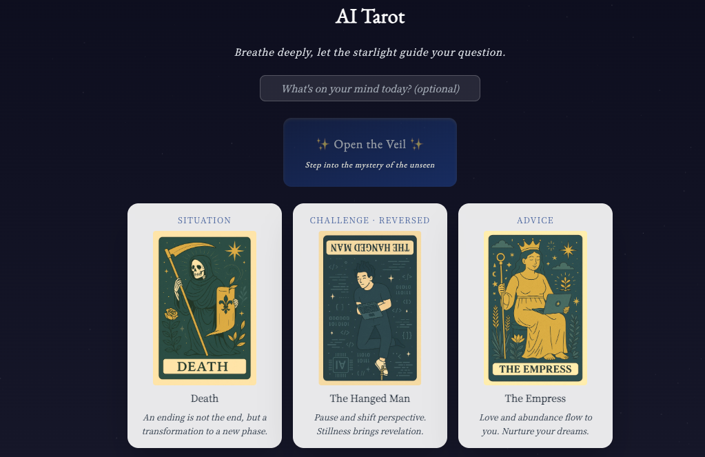

# AI Tarot ✨

A daily-guidance tarot app. Draw a three-card **Situation / Challenge / Advice** spread and get a bilingual (English + Traditional Chinese) AI-written reading that's genuinely different every time — not just in wording, but in voice, length, and form.

**Live:** [ai-tarot-app-jjey.vercel.app](https://ai-tarot-app-jjey.vercel.app/)



## Why it's not just "prompt → paragraph"

Most AI tarot demos ask a model for one fixed-shape response and call it done. This one intentionally varies the reading on every draw:

- **Randomized reader persona** — the server picks one of three distinct voices (a hushed lunar oracle, an urgent fiery prophet, a sparse ancient sage) for each reading, so the same three cards read completely differently depending on which persona is chosen.
- **Randomized length and form** — sometimes the reading is a tight 2-3 line burst, sometimes a flowing 4-6 line passage, sometimes fragmented free verse. No fixed template.
- **Reversed cards** — each drawn card has a chance of being reversed, and the prompt explicitly asks the model to let that invert or block the card's usual meaning.
- **Independent bilingual composition** — the English and Traditional Chinese readings are two separate creative works in the same prompt, not a translation of one into the other.
- **Optional daily question** — you can type what's on your mind before drawing, and the model is instructed to actually respond to it rather than bolt it onto the end.

## Features

- Three-card spread (Situation / Challenge / Advice), no-repeat draw from the 22 Major Arcana
- Staggered, one-at-a-time card reveal with a short "veil parting" pause for ritual pacing
- Server-side OpenAI key — the browser never sees it
- Basic per-IP rate limiting on the API route to guard against runaway usage/cost

## Tech stack

- **Frontend:** React + Vite + Tailwind CSS
- **Backend:** Vercel serverless function (`/api/tarot`)
- **AI:** OpenAI `gpt-4o-mini` via the Chat Completions API
- **Assets:** 22 Major Arcana card images, compressed to WebP

## Getting started

```bash
git clone https://github.com/yinjuchen/ai-tarot-app.git
cd ai-tarot-app
npm install
cp .env.example .env   # add your own OPENAI_API_KEY
npm run dev
```

`npm run dev` only runs the Vite frontend — it does **not** serve `/api/tarot`, so draws will fail locally with a plain `npm run dev`. To exercise the full flow (including the OpenAI call) locally, use the [Vercel CLI](https://vercel.com/docs/cli):

```bash
npm i -g vercel
vercel link
vercel dev
```

## Environment variables

| Variable         | Description                                         |
| ---------------- | ---------------------------------------------------- |
| `OPENAI_API_KEY` | OpenAI API key. Server-side only, never sent to the client. |

## Project structure

```
src/
  App.jsx        # main UI + draw flow (state machine for the reveal sequence)
  cardData.js     # the 22 cards + drawThreeCards() (no-repeat, reversed odds)
  spread.js       # Situation/Challenge/Advice position definitions
  gpt.js          # client for /api/tarot
api/
  tarot.js        # serverless function: builds the prompt, calls OpenAI,
                   # rate-limits by IP
```

## Notes

- `/api/tarot` is rate-limited to 5 requests per minute per IP to protect against cost from casual or automated abuse. It's an in-memory, per-instance limiter — good enough to stop naive scripting, not a substitute for a shared store (Upstash Redis / Vercel KV) in a higher-traffic production setting.
